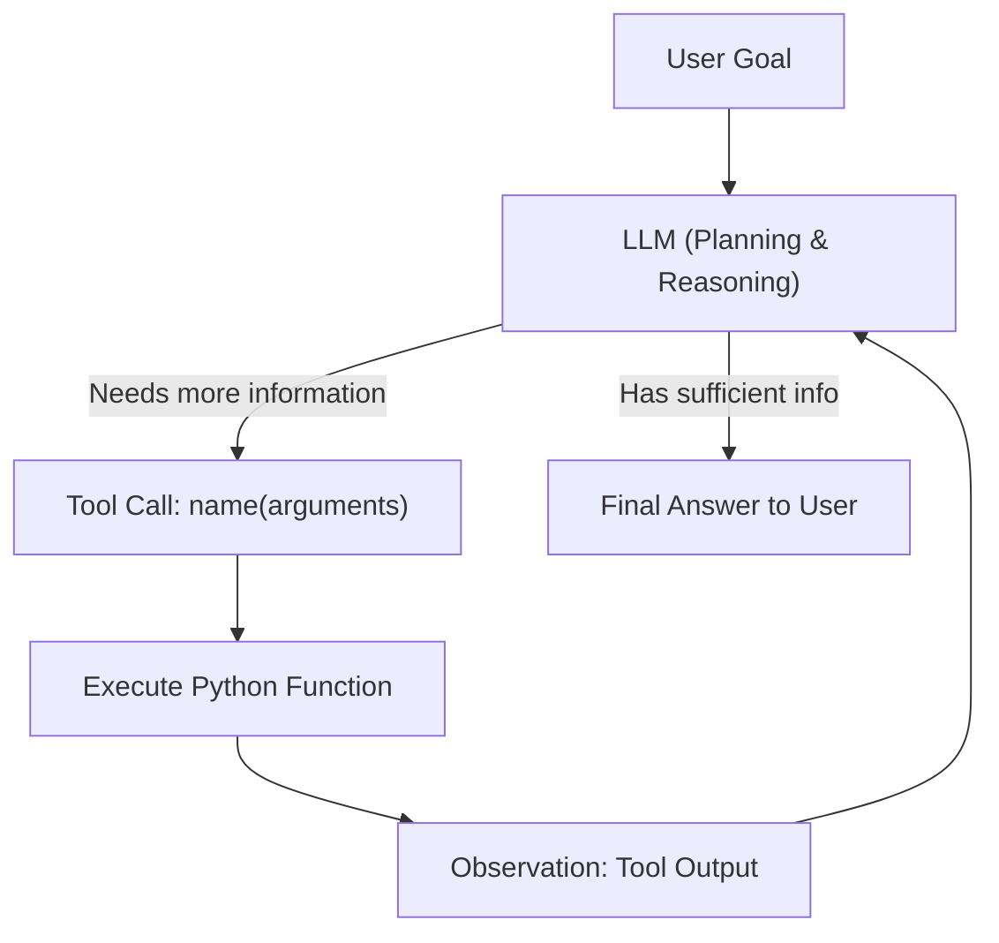

# Educational Agentic Workflow: Plan-and-Execute (ReAct) with Tools

A lightweight, transparent, from-scratch Python framework demonstrating how modern AI agents think, plan, and call tools to accomplish real-world goals.

Powered by **OpenAI Function Calling** and the **ReAct (Reason + Act)** pattern.

---

## 🧠 Core Concept: What is an Agentic Workflow?

A standard LLM call is **one-shot**: you give it a prompt, and it gives you text back. It cannot browse current databases, perform exact math calculations reliably, or take external actions.

An **Agentic Workflow** gives the LLM tools and a feedback loop:



### The ReAct (Reason + Act) Loop:
1. **Reason (Thought)**: The model determines what information is missing to solve the user's goal.
2. **Act (Action)**: The model selects a registered tool (e.g. `search_flights`) and provides the required parameters.
3. **Observe (Observation)**: The environment executes the Python function and feeds the real data back to the LLM.
4. **Iterate**: The LLM inspects the observation and either calls another tool (e.g. `get_baggage_policy` or `calculator`) or synthesizes the final answer.

### 🛡️ Step Ordering with Directed Acyclic Graphs (DAG):
While the ReAct loop allows flexible reasoning, critical real-world operations (like booking tickets or charging credit cards) must not occur prematurely.
The built-in `WorkflowDAG` defines strict prerequisite dependencies:
```
search_flights ──► get_baggage_policy ──► calculator ──► [Human Confirmation] ──► book_flight
```
If an LLM attempts to call `book_flight` before `search_flights` or `calculator` have completed, the DAG guardrail intercepts and blocks the call, preserving deterministic ordering.

### 🧠 Short-Term Working Memory & Scratchpad:
Agents need memory to maintain multi-turn dialogue context without exceeding model context limits:
1. **Dialogue Buffer (Sliding Window)**: Automatically tracks the conversation stream while pruning older turns beyond capacity (`max_messages`), ensuring tool-call atomicity.
2. **Working Scratchpad (Key Facts)**: A dedicated key-value store where the agent uses `save_memory_note` to record vital facts (e.g., `user_name`, `preferred_airline`, `budget`). These facts are pinned into the prompt and survive even when older dialogue turns are evicted.
3. **Session Persistence (`session_memory.json`)**: Live-syncs state to disk so you can inspect memory directly in your editor.

---

## 🗂️ Project Structure

```
agentic-workflow-trial/
├── agent/
│   ├── __init__.py         # Package exports
│   ├── config.py           # Configuration loader (.env, OPENAI_API_KEY, model)
│   ├── memory.py           # ShortTermMemory: sliding window, scratchpad, JSON persistence
│   ├── tools.py            # ToolRegistry, @tool decorator, flight & memory tools
│   ├── dag.py              # WorkflowDAG: step dependency and cycle management
│   ├── llm_client.py       # Direct OpenAI API client with function calling
│   └── core.py             # Agent class running ReAct loop with memory & DAG guards
├── examples/
│   ├── example_flight_search.py   # Flight search + baggage fare calculation
│   ├── example_trip_planner.py    # Multi-step: flights + baggage + weather advice
│   ├── example_human_in_loop.py   # Human-in-the-Loop verification & booking
│   ├── example_dag_workflow.py    # DAG dependency order enforcement
│   └── example_short_term_memory.py # Short-term working memory & scratchpad
├── tests/
│   ├── test_tools.py       # Unit tests for schemas and tool execution
│   ├── test_dag.py         # Unit tests for Workflow DAG & cycle detection
│   ├── test_agent_dry_run.py # Unit tests for configuration and agent setup
│   └── test_memory.py      # Unit tests for ShortTermMemory & JSON persistence
├── interactive_cli.py      # Real-time interactive terminal chat with agent
├── .env.example            # Environment template
└── README.md               # Educational guide
```

---

## 🚀 Getting Started

### 1. Set Up with `uv`
This project is configured for **[uv](https://github.com/astral-sh/uv)** for fast, reliable package management:
```bash
# Create a virtual environment and install dependencies
uv venv
source .venv/bin/activate
uv pip install openai python-dotenv

# Or install from pyproject.toml / requirements.txt:
uv pip install -r requirements.txt
```

### 2. Configure your OpenAI API Key
Create a `.env` file from the template:
```bash
cp .env.example .env
```
Open `.env` and set your key:
```env
OPENAI_API_KEY=sk-...
OPENAI_MODEL=gpt-4o-mini
```
*(You can also export in your terminal: `export OPENAI_API_KEY="sk-..."`).*

### 3. Run the Examples

#### Example 1: Flight Search & Fare Calculation
```bash
uv run example_flight_search.py
# or with active venv:
python3 example_flight_search.py
```

#### Example 2: Complete Trip & Packing Advisor (Multi-Step)
```bash
uv run example_trip_planner.py
# or with active venv:
python3 example_trip_planner.py
```

#### Example 3: Human-in-the-Loop Flight Verification & Booking
```bash
uv run example_human_in_loop.py
# or with active venv:
python3 example_human_in_loop.py
```

#### Example 4: Workflow DAG Step Order Enforcement
```bash
uv run example_dag_workflow.py
# or with active venv:
python3 example_dag_workflow.py
```

#### Example 5: Short-Term Working Memory & Scratchpad
```bash
uv run example_short_term_memory.py
# or with active venv:
python3 example_short_term_memory.py
```

#### Interactive Terminal Chat
Chat with your travel agent live and watch it plan and call tools in real-time.
Commands:
- `memory`: View active short-term memory capacity, sliding window, and scratchpad notes.
- `notes`: Inspect saved working facts.
- `set_var <key> <val>`: Manually pin a fact to working memory.
- `dag`: See current Workflow DAG dependency progress.
- `reset`: Clear memory, delete session file, and reset DAG.

```bash
uv run interactive_cli.py
# or with active venv:
python3 interactive_cli.py
```

---

## 🛠️ Built-in Tools

| Tool | Description | Parameters |
|---|---|---|
| `search_flights` | Search available flight routes, airlines, and base ticket prices | `origin`, `destination`, `date` |
| `get_baggage_policy` | Look up carry-on allowance and checked bag fees per carrier | `airline` |
| `calculator` | Safely evaluate mathematical expressions for fares, fees, and taxes | `expression` |
| `get_city_weather` | Check current conditions and travel packing recommendations | `city`, `date` |
| `book_flight` | Book confirmed flight tickets once human verification is provided | `flight_number`, `passenger_name`, `date` |
| `save_memory_note` | Save an important fact, preference, or constraint to working memory | `key`, `value` |
| `recall_memory_notes` | Recall all verified facts and preferences in working memory | *(None)* |


---

## 💡 How to Add Your Own Custom Tools

Adding a new tool is as simple as writing a regular Python function with type annotations and a docstring, then decorating it with `@tool`:

```python
from agent import tool

@tool(name="find_hotel", description="Search hotels in a city within a price budget.")
def find_hotel(city: str, max_price_per_night: float) -> str:
    """
    Search available hotels.
    :param city: Destination city name
    :param max_price_per_night: Maximum budget per night in USD
    """
    # Your database lookup or API call here
    return f"Found Grand Hotel in {city} for ${max_price_per_night - 20}/night."
```

The `@tool` decorator **automatically**:
1. Inspects the parameter names and Python type hints (`str`, `int`, `float`, `bool`).
2. Parses parameter descriptions from the docstring.
3. Generates the exact **OpenAI JSON Function Schema** that OpenAI's API requires.

---

## 🧪 Running Unit Tests

Run the test suite to verify tool schema generation, safe calculation, and agent configuration:
```bash
python3 -m unittest discover -s tests
```

---

## 🔭 Next Steps & Expansion Ideas

When you are ready to expand this framework, here are great concepts to explore:
1. **Persistent Memory**: Save conversation history to SQLite or JSON so the agent remembers past trips across sessions.
2. **Human-in-the-Loop**: Pause the agent before executing sensitive tools (like `book_ticket(credit_card=...)`) to request user confirmation.
3. **Live API Integration**: Replace mock flight/weather data with real APIs (e.g. Amadeus/Skyscanner, OpenWeatherMap).
4. **Multi-Agent Teams**: Have a "Researcher Agent" gather flights and a "Budget Agent" audit costs.
